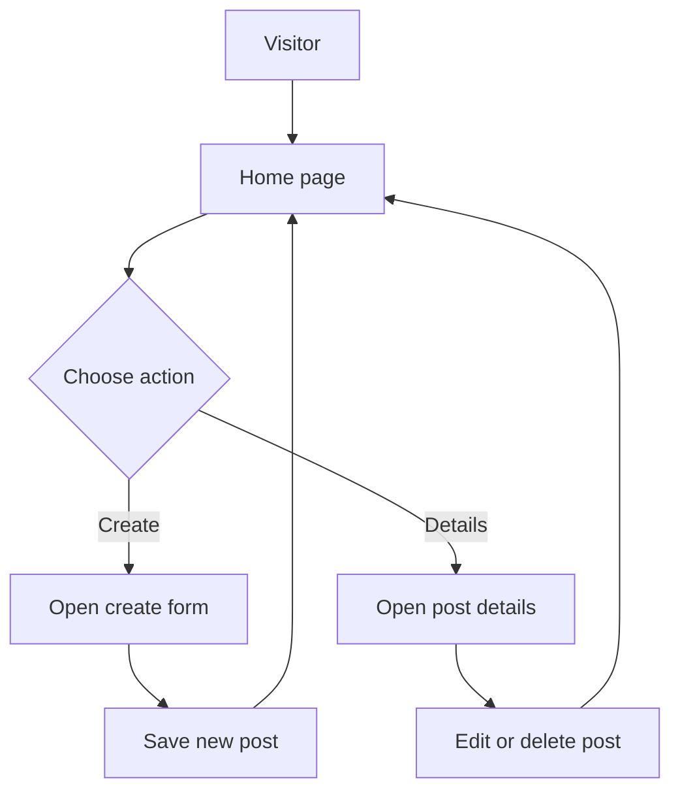

<p align="center">
  
</p>

<h1 align="center">simple-instagram-app</h1>

<p align="center"><i>A simple Instagram-inspired app for sharing posts with CRUD actions.</i></p>

<p align="center">
  
  
  
  
  
  
</p>

## 🚀 Project intro

simple-instagram-app is a small Instagram-inspired web application built with Node.js, Express, and EJS. It provides a simple CRUD experience for posts, allowing users to view posts, create new ones, see detailed information, edit existing content, and delete posts.

The app uses in-memory data storage, so posts are available while the server is running and reset when the server restarts.

## Table of Contents

- [🚀 Project intro](#-project-intro)
- [📁 Project structure](#-project-structure)
- [⭐ Differentiators](#-differentiators)
- [🔧 Features](#-features)
- [🧰 Tech stack](#-tech-stack)
- [⚙️ Installation and setup](#️-installation-and-setup)
- [🛣️ Routes](#️-routes)
- [🤝 Contributing](#-contributing)
- [📄 License](#-license)

## 📁 Project structure

```txt
simple-instagram-app/
├── index.js
├── package.json
├── LICENSE
├── public/
│   └── style.css
├── views/
│   ├── details.ejs
│   ├── edit.ejs
│   ├── form.ejs
│   └── index.ejs
└── images/
```

### Key files

- index.js: main server file that defines the routes and in-memory post data
- views/: EJS templates for the home page, post details, edit form, and create form
- public/style.css: stylesheet for the UI
- images/: folder used for static image files referenced by posts

## ⭐ Differentiators

- Lightweight and beginner-friendly CRUD demo
- Simple Express-based routing with EJS views
- In-memory storage makes the app easy to run locally
- Clean, minimal UI inspired by Instagram-style social feeds

## 🔧 Features

### Core features

| Feature | Status | Notes |
| --- | --- | --- |
| Browse posts | ✅ Current | View a list of posts on the home page |
| Create post | ✅ Current | Add username, image, name, age, and content |
| View details | ✅ Current | Open the full details for any post |
| Edit post | ✅ Current | Update existing post content and metadata |
| Delete post | ✅ Current | Remove posts from the in-memory list |
| REST-style routing | ✅ Current | Built with Express routes and method override |

### App flow



## 🧰 Tech stack

- **Runtime:** Node.js
- **Server framework:** Express
- **Template engine:** EJS
- **Frontend:** HTML, CSS, JavaScript
- **Request handling:** method-override
- **ID generation:** uuid
- **Storage:** In-memory data store

## ⚙️ Installation and setup

### Prerequisites

- Node.js installed on your machine

### Steps

```bash
git clone <your-repository-url>
cd simple-instagram-app
npm install
node index.js
```

The app runs on port 8080 by default.

Open your browser at:

```text
http://localhost:8080
```

## 🛣️ Routes

The app includes these main routes:

- GET / -> redirects to /posts
- GET /posts -> shows the list of posts
- GET /posts/form -> displays the form to create a new post
- POST /posts -> creates a new post
- GET /posts/:id -> shows the edit page for a post
- PATCH /posts/edit/:id -> updates a post
- GET /posts/details/:id -> shows detailed information for a post
- DELETE /posts/delete/:id -> deletes a post

## 📝 Notes

- Posts are not stored in a database.
- Data is kept in memory inside the server process.
- The create form includes an image field, and the app references image files stored in the images folder.

## 🤝 Contributing

Contributions are welcome. You can fork the repository, make your changes, and open a pull request.

## 📄 License

This project is licensed under the ISC License. See the LICENSE file for more details.
